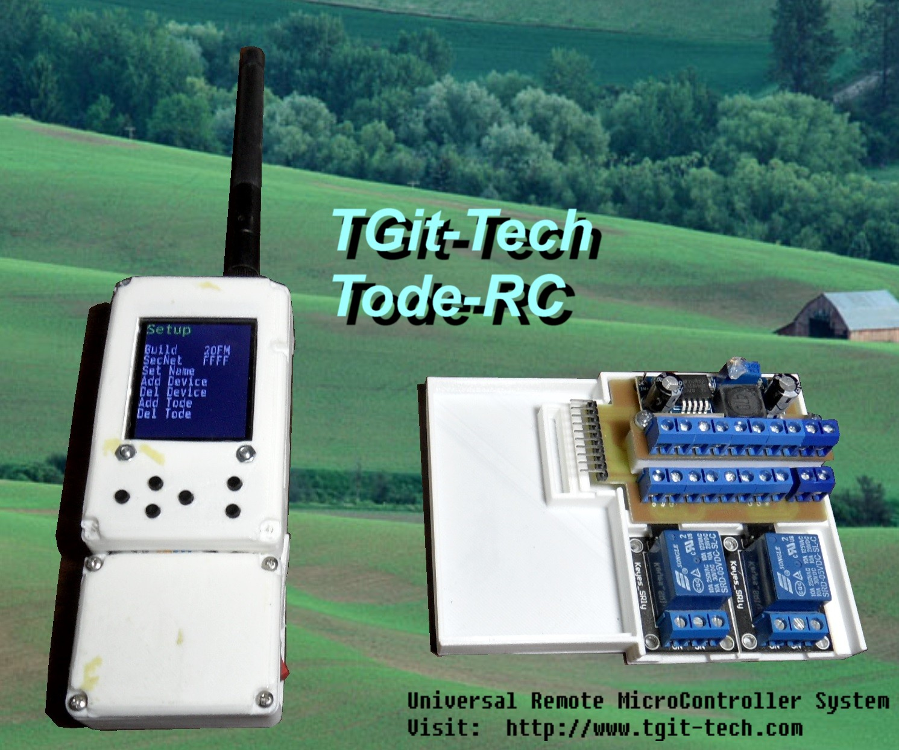

-----------------------------------------------------------------------------------
# Tode-RC
-----------------------------------------------------------------------------------
A Universal Remote MicroController System Project.

- Mini Mega 2560 Pro Arduino type Micro-Controller
- 1W 433MHz LoRa Trasceiver ( 2-mile+ range using Ebyte-E32 Module )
- 1.8" TFT Display and 6-Button Keypad
- Hardware adaptation by module building blocks
- User friendly On-Controller IO configuration

It's like a RF-Node but it's called a 'Tode'.

-----------------------------------------------------------------------------------
#Project Firmware & Expansions
-----------------------------------------------------------------------------------
- Firmware at https://github.com/TGit-Tech/Tode-RC-Firmware
- Side-IO Screw Terminals #SIOST (pictured) https://github.com/TGit-Tech/Tode-SIOST

-----------------------------------------------------------------------------------
#Project Status
-----------------------------------------------------------------------------------
- Release 21C9
Initial Release.  All items/files appear to work properly.

-----------------------------------------------------------------------------------
#Project Purchase Options
-----------------------------------------------------------------------------------
Parts & Supplies ONLY ( You must assemble and solder and make 3D-prints )\
Builders Kit\
- https://www.tindie.com/products/tgittech/tode-rc-builders-kit
- https://www.etsy.com/listing/1111355606/tode-rc-builders-kit
\
Assembled Tode-RC\
- https://www.tindie.com/products/tgittech/tode-rc/
- https://www.etsy.com/listing/1121613074/tode-rc
