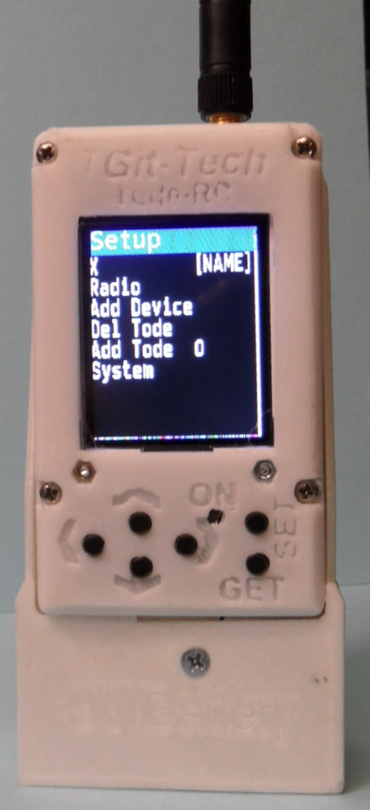
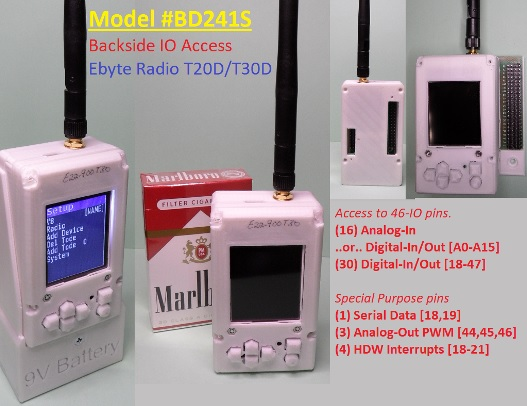
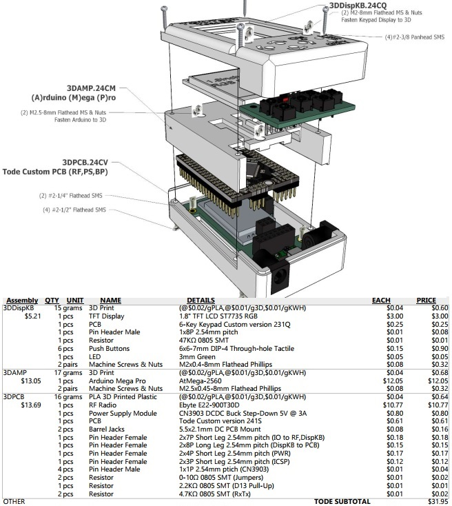
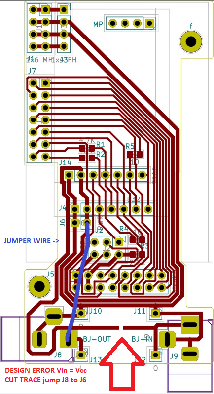

-----------------------------------------------------------------------------------
# Tode-RC
-----------------------------------------------------------------------------------
A User-Interfaced Arduino Mega Pro with Ebyte LoRa Radio.\
It's like a RF-Node but call it a 'Tode'.

- Arduino Mini Mega 2560 compatible Micro-Controller
- 1.8" TFT Display and 6-Button Keypad
- User friendly On-Controller IO configuration

See the docs/ Users-Guide for device support list and usage details including MQTT OpenHab connection abilities.

Benefits of the Tode over ESP32 LoRa Modules
- Big enough to be practical.  Small enough to be handy.
- 5V TTL-IO (Ebyte-RF 5V match, 200mW/IO power, Ready-fit for 5V Sensors)
- 54-IO pins (leaving (46) with display, keypad, radio connected)
- 30dbm (T30D) Transmission Power with Ebyte LoRa Modules
- 3-Piece plug-together assembly keeps individual parts easy to swap/salvage.

Due to button sticking issues the buttons are now just black tops shown in first image.

-----------------------------------------------------------------------------------
#Project Purchase Options
-----------------------------------------------------------------------------------
Purchase pre-made at...
- https://www.tindie.com/stores/tgittech/
- https://www.etsy.com/shop/TGitTech

-----------------------------------------------------------------------------------
#Project Firmware & Expansions
-----------------------------------------------------------------------------------
- Firmware at https://github.com/TGit-Tech/Tode-RC-Firmware
	- Be sure to set Backplane model in config.h
- Side-IO Screw Terminals #SIOST (pictured) https://github.com/TGit-Tech/Tode-IO
- Back-IO Pin Header Array #BIOPH https://github.com/TGit-Tech/Tode-IO

-----------------------------------------------------------------------------------
#Project Status
-----------------------------------------------------------------------------------
USE Tode-RC.BD241S.  It supports 1W(T30D) or 1/4W(T20D) Ebyte Radios.\
Double Check that the PCB doesn't have the below design error.

Model SD23CF(In-Design/BETA) supports 2W(T33D) Radios but only 7-IO pins.
	
- Previous Release Notes
NEW changes.  The old model SA212K with analog keypad will become obsolete (not supported).
All future designs will have digital keypads as analog was spotty with moisture and 
temperature change.  Secondary Power Supplies are On-PCB now for both SD23CF(Side-IO) 
and BD241S(Back-IO).  Firmware will auto-detect E32-433T20D/T30D, E22-400T30D/900T30D 
and E220-400T30D Ebyte Radios.
