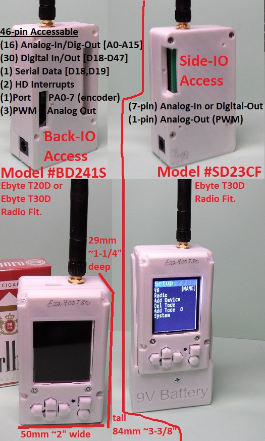

-----------------------------------------------------------------------------------
# Tode-RC
-----------------------------------------------------------------------------------
A Universal Remote MicroController System Project.

- Mini Mega 2560 Pro Arduino type Micro-Controller
- 1.8" TFT Display and 6-Button Keypad
- Hardware adaptation by module building blocks
- User friendly On-Controller IO configuration
- (2) Models to chose from
	- SD23CF supporting 2W(T33D) or 1W(T30D) Ebyte Radios and 7-IO points
	- BD241S supporting 1W(T30D) or 250mW(T20D) Ebyte Radios and 46-IO points

It's like a RF-Node but it's called a 'Tode'.

-----------------------------------------------------------------------------------
#Project Firmware & Expansions
-----------------------------------------------------------------------------------
- Firmware at https://github.com/TGit-Tech/Tode-RC-Firmware
	- Be sure to set Backplane model in config.h
- Side-IO Screw Terminals #SIOST (pictured) https://github.com/TGit-Tech/Tode-IO
- Back-IO Pin Header Array #BIOPH https://github.com/TGit-Tech/Tode-IO

-----------------------------------------------------------------------------------
#Project Status
-----------------------------------------------------------------------------------
- Release Candidate 242I
NEW changes.  The old model SA212K with analog keypad will become obsolete (not supported).
There will no longer be an outdoor 3D-Printed box as commercially available ones are
so much better weather-proofing and durability wise.  All future designs will have
digital keypads as analog was spotty with moisture and temperature change.  Secondary 
Power Supplies are On-PCB now for both SD23CF(Side-IO) and BD241S(Back-IO).  BD241S is
the ideal build because of it's 46-Pin access however SD23CF allows Ebyte T33D(2W) radios
that cover-up Arduino pin access so it will continue to be supported in the future.  Firmware
auto-detects E32-433T20D/T30D, E22-400T30D/900T30D and E220-400T30D Ebyte Radios.

-----------------------------------------------------------------------------------
#Project Purchase Options
-----------------------------------------------------------------------------------
Parts & Supplies ONLY ( You must assemble and solder and make 3D-prints )\
Builders Kit
- https://www.tindie.com/products/tgittech/tode-rc-builders-kit
- https://www.etsy.com/listing/1111355606/tode-rc-builders-kit
  
Assembled Tode-RC
- https://www.tindie.com/products/tgittech/tode-rc
- https://www.etsy.com/listing/1121613074/tode-rc
